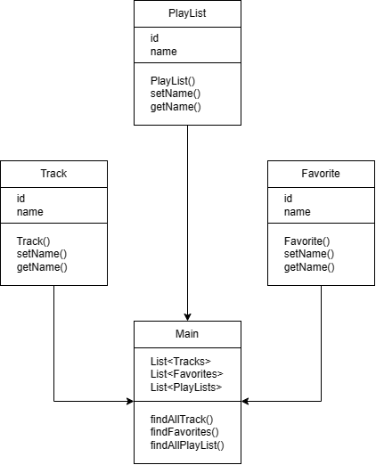

# Диаграмма классов 

# Глоссарий

1. Track - класс, отображающий проигрываемый трек;
2. PlayList - класс, отображающий плейлист(его содержание);
3. Favorite - класс, отображающий избранные треки;
4. Main - класс, отображающий главное activity при запуске приложения.