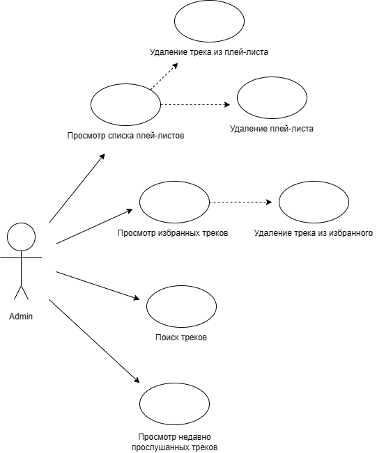

# Диаграмма вариантов использования 

# Глосарий 

| Термин | Определение |
|:--|:--|
| Пользователь | Человек, использующий приложение |

# Актёры 

| Актёр | Описание |
|:--|:--|
| Пользователь | Человек, использующий приложение |

# 2 Варианты использования

## 2.1 Просмотр плей-листов
**Описание.** Вариатн использования "Просмотр плей-листов" позволяет пользователю просмотреть наличие созданных им плейлиство.Также пользователь может удалить данный плейлист или трек из данного плейлиста.

### 2.1.1 Удаление треков из плейлиста

### 2.1.2 Удаление плейлиста

## 2.2 Просмотр избранных треков
**Описание.** Вариант использования " Просмот избранных треков" выводит список избранных треков.

### 2.2.1 Удаление треков

## 2.3 Просмотр недавно прослушанных треков 
**Описание.** Варинат использование " Просмотр недавно прослушанных треков " выводит список недавно прослушанных треков.

## 2.4 Поиск треков
**Описание.** Вариант использования " Поиск треков " позволяет пользователю найти нужный трек, который хранится на нашем устройстве.

