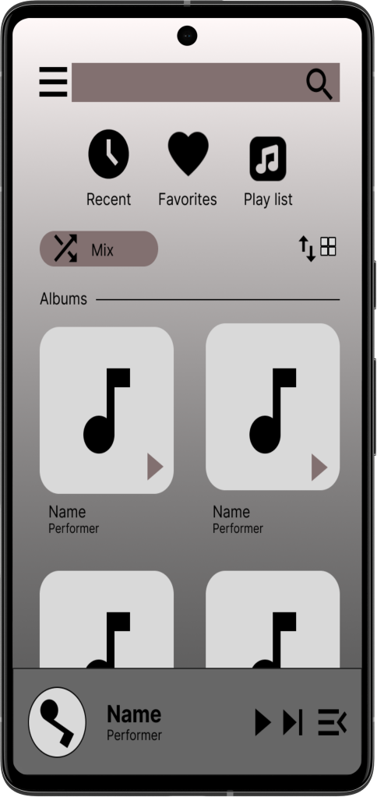

# Требования к проекту

<a name="intro"/>

# 1 Введение
<a name="appointment"/>

## 1.1 Назначение
В этом документе описана работа приложения "My music" для OC Android.Оснавная цель : удобный и понятный интерфейс для выбора и прослушивания любимой музыки.

<a name="business_requirements"/>

## 1.2 Границы и основыне функции

- Выбор и преключение трека для прослушивания
- Добавление треков в  плейлист
- История прослушанных ранее треков 

Приложение созданно в качестве простого способа к достопу к музыке на вашем телефоне и только в границах вашей системы(установленных файлов mp3).
<a name="analogues"/>

## 1.3 Аналоги
Аналогами являются такие приложения как Spotify, SoundCloud, VKMusic. Особенностью этих аналогов является то, что они позволяют прослушивать музыку через облачное хранилище а также имеют ии для подборки рекомендаций.

<a name="user_requirements"/>

# 2 Требования пользователя

<a name="user_interface"/>

## 2.1 Интерфейс пользователя
Главный экран  

  

Окно проигрывателя.  

 

Окно рвыбора папки с музыкой

  

<a name="user_specifications"/>

## 2.3 Характеристики пользователей

Приложение ориентировано на людей, которым нужен инструмент для прослушивания музыки. Приложением могут любые пользователи.

<a name="assumptions_and_dependencies"/>

## 2.4 Предположения и зависимости
1. Приложение не может редактировать аудио-файлы
2. Приложение не может изменять названия файлов

<a name="system_requirements"/>

# 3 Системные требования

<a name="functional_requirements"/>

## 3.1 Функциональные требования
- Версия Android не ниже 5.0

<a name="non-functional_requirements"/>

## 3.2 Нефункциональные требования
- Удобность в использовании
- Надежность

### 3.2.3 Ограничения
1. Приложение реализовано для ОС Android;
2. Язык, на котором реализована программа, - Java.
